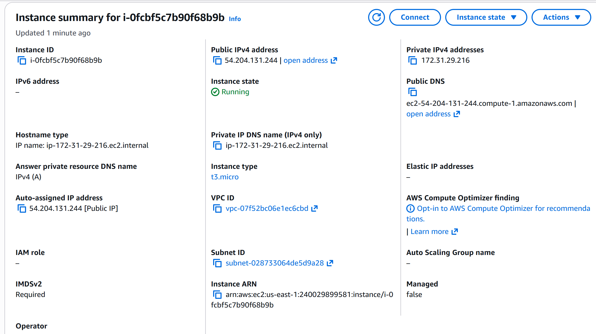
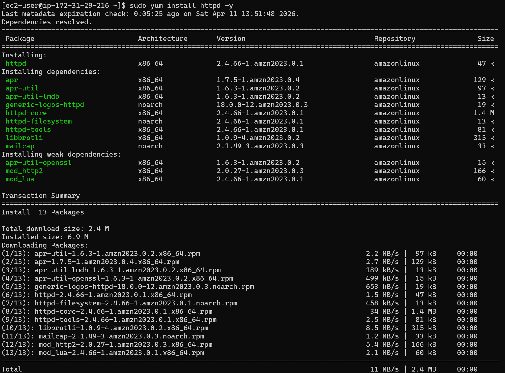
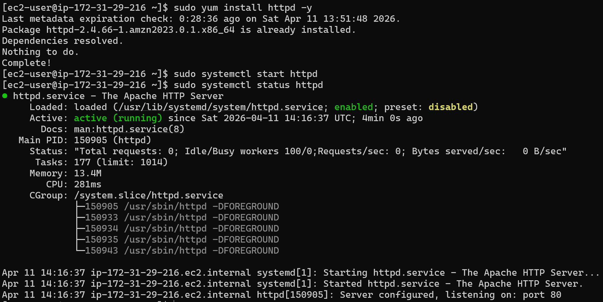
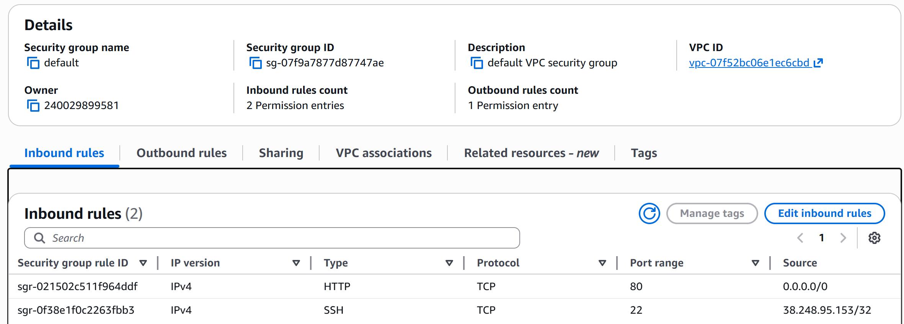
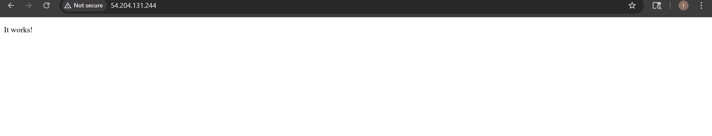
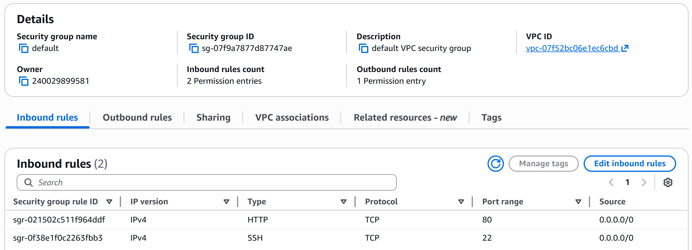
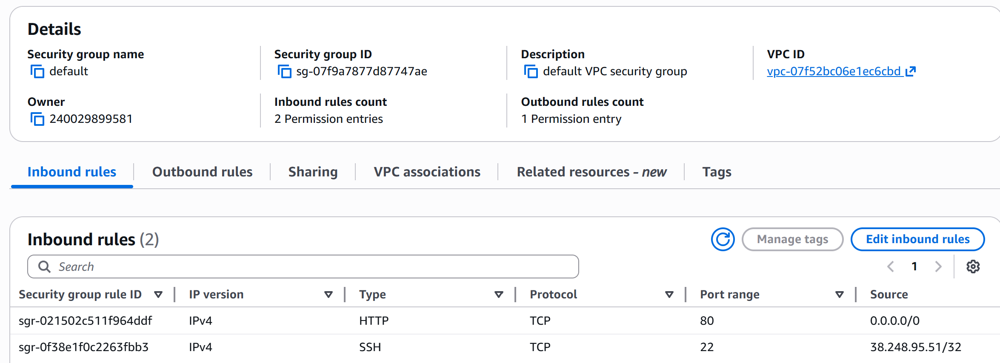
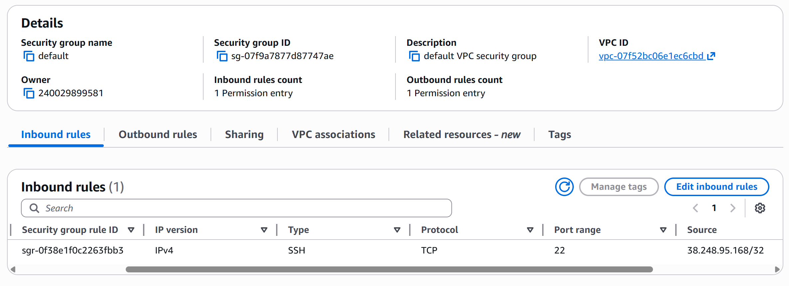
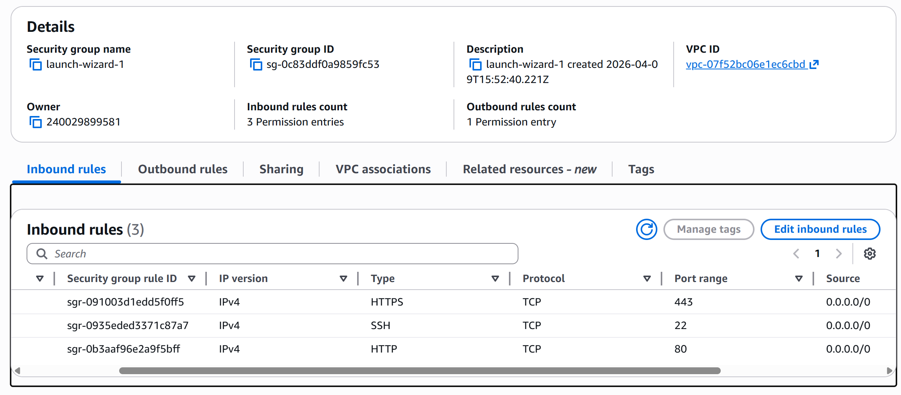

# ☁️ AWS EC2 Web Server Deployment & Security Hardening Lab

## 📌 Project Overview

This project demonstrates the deployment of a web server on an Amazon EC2 instance, followed by intentional security misconfiguration and remediation. The goal is to simulate a real-world cloud environment, identify security risks in network access controls, and apply least-privilege principles to harden the system.

---

## 🎯 Objectives
* Launch and configure an EC2 instance
* Deploy a basic Apache web server
* Configure security groups for controlled access
* Simulate a security misconfiguration
* Identify associated risks
* Apply remediation using least-privilege access controls

---

## 🛠️ Technologies Used
* AWS EC2
* Amazon Linux 2
* Apache Web Server (httpd)
* AWS Security Groups
* SSH (Secure Shell)

---

## 🚀 Deployment Steps
### 1. EC2 Instance Setup

* An EC2 instance was launched in AWS and configured with a public IPv4 address to allow external connectivity.




### 2. Web Server Installation

Apache web server was installed and started:




Web Server Active and Running




---

3. Security Group Configuration

Inbound rules were configured to allow:

* SSH (port 22) for remote administration
* HTTP (port 80) for web traffic



Once configured, the default Apache test page (“It works!”) was successfully accessible via browser using the EC2 public IP.

Validated the EC2 instance was publicly accessible over HTTP (port 80) from an external network using a mobile device on cellular data.




---

## ⚠️ Security Misconfiguration & Testing
Misconfiguration Introduced

* SSH access was intentionally set to:

Source: 0.0.0.0/0



This allowed unrestricted SSH access from any IP address on the internet.

Risk Analysis

This configuration introduces critical security risks:

* Exposure to brute-force SSH attacks
* Unauthorized login attempts from global sources
* Violation of least-privilege access principles

Validation

Public accessibility of the instance confirmed that external networks could reach the system under the misconfigured rule set.

---

## 🔐 Remediation & Hardening

To mitigate risk, SSH access was restricted to a trusted IP address:

Source: 38.248.95.51/32   (My public IP)



This ensures only authorized devices can initiate SSH connections.

---

## 📚 Key Learnings
*  Security Groups function as a virtual firewall for EC2 instances
*  0.0.0.0/0 represents unrestricted public internet access and should be avoided for administrative ports
*  Least-privilege access is critical in cloud security design
*  Misconfigurations in cloud environments can directly expose infrastructure to attack
*  Proper validation and remediation are essential parts of secure cloud operations

---

## 🧠 Conclusion

This lab demonstrated the full lifecycle of a cloud-hosted service: deployment, exposure, risk identification, and remediation. It reinforces foundational cloud security principles used in real-world AWS environments.

.....

# ☁️ Secure Cloud Environment Lab (AWS EC2)

## 📌 Project Overview

Built and secured a cloud-based virtual server using AWS EC2.
This project demonstrates basic cloud deployment, network configuration, and security hardening.

---

## 🎯 Objectives

* Launch virtual server (EC2 instance)
* Configure network access (using security groups)
* Connect securely via SSH
* Fixed security misconfigurations from errors in initial setup
* Document and verify system functionality

---

## 🧱 Architecture

* **Cloud Provider:** AWS
* **Service:** EC2 (Elastic Compute Cloud)
* **OS:** Amazon Linux 2023
* **Access Method:** SSH (Port 22)
* **Public Access:** using Public IPv4

---

## ⚙️ Steps Performed

### 1. EC2 Setup  

* Created EC2 instance (t3.micro)
* Selected Amazon Linux 2023 AMI
* Generated key pair (.pem file)

### 2. Network Configuration

* Allowed SSH access (Port 22)
* Initially allowed broad access (for testing)
* Verified public IP assignment

### 3. SSH Connection

* Connected using terminal:

```bash
ssh -i TestKeyPair.pem ec2-user@54.204.131.244>
```

### 4. System Verification

* Confirmed successful login
* Executed basic Linux commands (`ls`, `pwd`)

### 5. Security Hardening

* Identified overly permissive security group rules
* Restricted SSH access to **My IP only**
* Removed unnecessary open ports

---

## 5. 🔐 Security Concepts Demonstrated

* Principle of Least Privilege
* Secure Remote Access (SSH)
* Network Access Control (Security Groups)
* Cloud Security Best Practices

---

## 📸 Screenshots







---

## 🧠 Key Takeaways

* Learned how to deploy and access cloud infrastructure
* Understood importance of restricting network access
* Gained hands-on experience with AWS security controls

---

## 🚀 Next Steps

* Install and configure a web server (HTTP/HTTPS)
* Simulate and fix additional vulnerabilities
* Implement logging and monitoring (CloudTrail)

---

## 📁 Repository Structure

* README.md → Project documentation
* /screenshots → Supporting images
* /notes → Commands and configuration details

---
